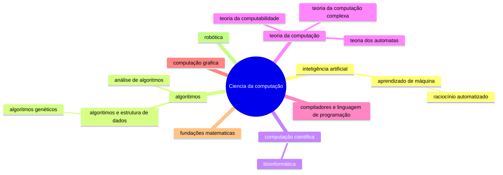

# Inteligência Artificial

<h2> Sidney, Guilherme e Matheus </h2>
<div class="pt-12">
  <span @click="$slidev.nav.next" class="px-2 py-1 rounded cursor-pointer" hover="bg-white bg-opacity-10">
     <carbon:arrow-right class="inline"/>
  </span>
</div>

<div class="w-60 relative mt-6">
  <div class="relative w-40 h-40">
    
 
    
  </div>
</div>


  
  


<!--
The last comment block of each slide will be treated as slide notes. It will be visible and editable in Presenter Mode along with the slide. [Read more in the docs](https://sli.dev/guide/syntax.html#notes)
-->


---
transition: fade-out
---

# Topicos


<Toc maxDepth="1"></Toc>

<br>


<!--
You can have `style` tag in markdown to override the style for the current page.
Learn more: https://sli.dev/guide/syntax#embedded-styles
-->

<style>
h1 {
  background-color: #2B90B6;
  background-image: linear-gradient(45deg, #4EC5D4 10%, #146b8c 20%);
  background-size: 200%;
  -webkit-background-clip: text;
  -moz-background-clip: text;
  -webkit-text-fill-color: transparent;
  -moz-text-fill-color: transparent;
}
</style>

<!--
Here is another comment.
-->

---
layout: default
---

# Papel do cientista da computação 

<h3>Bases teóricas e práticas para o desenvolvimento de algoritmos, modelos e técnicas computacionais para simular a inteligência humana.</h3>
<br>
<iframe src="https://giphy.com/embed/l0NwPdduX7IL1rS1i" width="480" height="449" frameBorder="0" class="giphy-embed" allowFullScreen></iframe><p><a href="https://giphy.com/gifs/c64-varundo-l0NwPdduX7IL1rS1i">via GIPHY</a></p>

<br>


---
transition: slide-up
level: 2
---

# Aprendizado de maquina: algoritmos

<h2>1.Linear Regression</h2>
<h2>2.Neural Networks</h2>
<h2>3.XGBoost</h2>
<br>
<iframe src="https://giphy.com/embed/YknAouVrcbkiDvWUOR" align="center" width="480" height="350" frameBorder="3" class="giphy-embed" allowFullScreen></iframe><p><a href="https://giphy.com/gifs/kitp-YknAouVrcbkiDvWUOR">via GIPHY</a></p>


---
layout: image-right
---


---

# Rede Neural

<div grid="~ cols-2 gap-4">
<div>

<h3> As redes neurais artificiais (RNAs) são modelos computacionais inspirados no sistema nervoso central, especialmente o cérebro, capazes de aprender e reconhecer padrões.
 Elas são representadas como sistemas de neurônios interconectados que simulam o funcionamento das redes neurais biológicas.
</h3>
  
</div>
<div>


<Tweet id="925014446241734656" scale="0.65" />

</div>
</div>

<!--
Presenter note with **bold**, *italic*, and ~~striked~~ text.

Also, HTML elements are valid:
<div class="flex w-full">
  <span style="flex-grow: 1;">Left content</span>
  <span>Right content</span>
</div>
-->

---
class: px-20
---


---
preload: false
---

# Chat GPT e API

criar imagens do zero, acresentar algo em uma imagem, criar variações de uma imagem

```py
#Gera imagem
response = openai.Image.create(
  prompt="a white siamese cat",
  n=1,
  size="1024x1024"
)
image_url = response['data'][0]['url']

```

<div class="w-60 relative mt-6">
  <div class="relative w-40 h-40">
    
 
    
  </div>
</div>

<!-- vue script setup scripts can be directly used in markdown, and will only affects current page -->
<script setup lang="ts">
const final = {
  x: 0,
  y: 0,
  rotate: 0,
  scale: 1,
  transition: {
    type: 'spring',
    damping: 10,
    stiffness: 20,
    mass: 2
  }
}
</script>

<div
  v-motion
  :initial="{ x:35, y: 40, opacity: 0}"
  :enter="{ y: 0, opacity: 1, transition: { delay: 3500 } }">

[API CHAT GPT](https://platform.openai.com/docs/guides/images/introduction)

</div>

---

# Reconhecimento de gestos: reconhecimento de linguagem de sinais 

<br>
<Tweet id="1497557100389617670" scale="0.60"/>

---

# Ciência da Computação visão geral


<div class="grid grid-cols-4 gap-5 pt-4 -mb-6">




</div>

<br>
<br>

[video bom sobre o mapa da ciencia da computação](https://www.youtube.com/watch?v=SzJ46YA_RaA)


---
layout: center
class: text-center
---

# .
